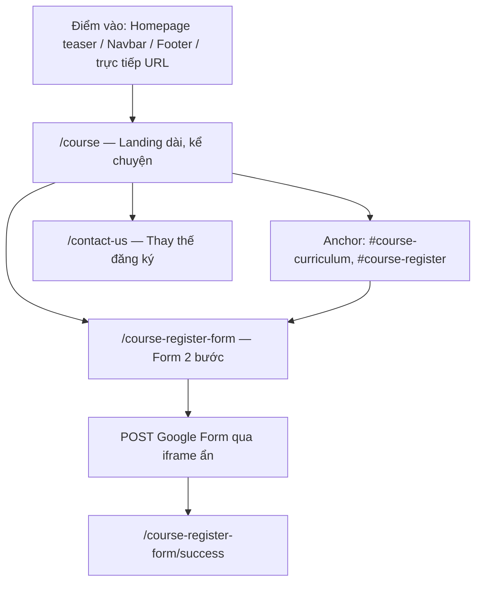

# Marketing Logic: Trang Khóa Học

**Khóa học:** *Từ Khối Lệnh Đến Phần Cứng* / *From Blocks to Hardware*  
**Route chính:** `/course`  
**Cập nhật:** 2026-07-10  
**Audience:** team marketing, content, vận hành, dev cần hiểu *tại sao* trang được cấu trúc như vậy và *sửa nội dung ở đâu*.

---

## Đọc cùng

Tài liệu này **bổ sung**, không thay thế các file sau:

| Tài liệu | Vai trò |
|---|---|
| [product_brief.md](./product_brief.md) | Ý tưởng sản phẩm ban đầu, đối tượng, thông điệp gốc |
| [PRD.md](./PRD.md) | Yêu cầu chi tiết (một số điểm đã lệch implementation — xem §8) |
| [DATA_CONTRACT.md](./DATA_CONTRACT.md) | Hợp đồng dữ liệu kỹ thuật, pattern `{ vi, en }`, quy ước ảnh |
| [technical_SPEC.md](./technical_SPEC.md) | Spec triển khai, routes, component map |
| [ACCEPTANCE_CRITERIA.md](./ACCEPTANCE_CRITERIA.md) | Checklist QA (một số tiêu chí cũ lệch — xem §8) |
| [google-form-registration.md](../google-form-registration.md) | Bảo trì Google Form, entry IDs, refresh mapping |
| **MARKETING_LOGIC.md** (file này) | Funnel, logic section, CTA, form, analytics, checklist vận hành |

**Source of truth cho copy đang live:** `src/data/course*.ts` + component inline copy. Khi PRD và implementation mâu thuẫn, tra §8 trước khi chỉnh tài liệu cũ.

---

## 1. Tổng quan marketing

### 1.1 Sản phẩm

Khóa STEM **12 buổi** cho học sinh **cấp 1–2** (tiểu học & THCS sơ cấp), hành trình:

**Scratch → flowchart → mBlock → Arduino → cảm biến/servo → dự án capstone (đấu trường robot).**

Tên hiển thị:
- **VI:** Từ Khối Lệnh Đến Phần Cứng
- **EN:** From Blocks to Hardware

### 1.2 Đối tượng

| Nhóm | Vai trò trên trang | Cần gì |
|---|---|---|
| **Phụ huynh** | Người quyết định đăng ký | Hiểu nhanh giá trị, thấy lộ trình rõ, tin đội ngũ, CTA đăng ký dễ tìm |
| **Học sinh cấp 1–2** | Người hứng thú, có thể xem cùng PH | Thấy sản phẩm thật (robot, LED, cảm biến), không bị ngôn ngữ quá hàn lâm |
| **Trung tâm / giáo viên** | Triển khai lớp | Giáo trình có cấu trúc, phân tầng Cấp 1–2, mỗi buổi có output |

### 1.3 Thông điệp cốt lõi

> *"Con không chỉ học lập trình. Con học cách suy nghĩ, giải quyết vấn đề và tạo ra sản phẩm công nghệ của riêng mình."*

(Nguồn gốc: [product_brief.md](./product_brief.md) §4 — dùng làm north star cho headline, lead, outcomes.)

### 1.4 Mục tiêu trang `/course`

Trong **~30 giây** đầu, người xem phải:

1. Hiểu **học gì** (Scratch → phần cứng thật).
2. Thấy **sản phẩm cuối khóa** (capstone đấu trường robot).
3. **Tin tưởng** đội Robotics Sóc Sơn (trust section + proof line hero).
4. Có **CTA đăng ký rõ** (hero, navbar, cuối trang).

### 1.5 Điểm khác biệt marketing

| Điểm | Ý nghĩa với phụ huynh |
|---|---|
| Scratch → **phần cứng thật** | Con không chỉ kéo thả trên màn hình |
| **Flowchart trước code** | Con hiểu logic trước khi viết chương trình |
| **AI là trợ lý** | Khác với "chatbot làm bài hộ" — AI hỗ trợ debug, gợi ý |
| **Lớp hỗn cấp 1–2** | Một lớp, hai mức thử thách — trả lời "con tôi có theo kịp không?" |
| **Mỗi buổi có sản phẩm** | Không học chay — credibility qua curriculum chi tiết |

### 1.6 Ghi chú brand / UI

PRD §5 mô tả UI "sáng, giáo dục, thân thiện". **Implementation hiện tại** tuân constraint dự án sponsor site: **dark arena / cyan glow** (xem `DESIGN.md`, `src/app/globals.css`). Content team viết copy cho nền tối, accent cyan — không assume light theme.

**Surface phụ (ngoài funnel chính):** [`/course/arduino-mblock-deck`](../course/arduino-mblock-deck/WIREFRAME.md) — deck giáo trình Arduino/mBlock riêng, không phải landing chuyển đổi `/course`.

---

## 2. Cung marketing (funnel)

### 2.1 Sơ đồ luồng chuyển đổi



### 2.2 Ba luồng chính

**A — Duyệt rồi chuyển đổi (long-form)**

```
/course → đọc sections → #course-register (hoặc CTA hero) → /course-register-form → success
```

Phù hợp phụ huynh cần thuyết phục: problem → outcomes → curriculum → capstone → FAQ.

**B — Đăng ký trực tiếp (short path)**

```
Navbar "Đăng ký khóa học" / Footer "Đăng ký khóa học" → /course-register-form → success
```

Phù hợp người đã biết khóa hoặc quay lại từ link campaign.

**C — Liên hệ thay vì form**

```
/course → #course-register → "Liên hệ để thêm chi tiết" → /contact-us
```

Phụ huynh muốn hỏi thêm trước khi điền form (học phí, lịch khai giảng, v.v.).

### 2.3 Điểm vào chi tiết

| Nguồn | Vị trí DOM | Component | Hành động | Analytics |
|---|---|---|---|---|
| Homepage | `#course-teaser` | `src/components/homepage/CourseTeaser.tsx` | CTA "Xem khóa học" → `/course` | `cta_clicked` (qua `CTAButton`) |
| Navbar | mọi trang trong course flow | `src/components/layout/Navbar.tsx` | Trên `/course`: CTA "Đăng ký khóa học" → `/course-register-form` | `cta_clicked` |
| Navbar | mọi trang | `Navbar.tsx` | Link "Khóa học" → `/course` (nav thường) | `nav_section_clicked` |
| Footer | mọi trang | `src/components/layout/Footer.tsx` | "Khóa học" → `/course`; "Đăng ký khóa học" → form | **Không** track (`BootLink`) |
| Direct / SEO / ads | — | — | URL `/course` hoặc `/course-register-form` | `course_page_viewed` / `course_register_page_viewed` |
| Sitemap | — | `src/app/sitemap.ts` | Liệt kê `/course`, `/course-register-form` | — |

**Course flow** (navbar đổi CTA): `pathname === "/course"` hoặc `pathname.startsWith("/course-register-form")` — xem `Navbar.tsx` L28–30.

---

## 3. Kiến trúc trang `/course` — thứ tự & logic từng section

Composition trong `src/app/course/page.tsx`:

```tsx
<CourseHero />
<CourseProblem />      {/* problem + solution gộp */}
<CourseOutcomes />
<CourseCurriculum />
<CourseProjects />
<CourseMethod />
<CourseLeveling />
<CourseAIUsage />
<CourseTrust />
<CourseFAQ />
<CourseRegister />
{/* CourseOffer — chưa mount; xem §3.3 */}
```

Analytics page-level: `PageAnalytics` fire `course_page_viewed` với `surface="/course"`.

### 3.1 Bảng section → marketing → data

| # | Section | Anchor `id` | Mục đích marketing | Nguồn dữ liệu | Component |
|---|---|---|---|---|---|
| 1 | Hero | — | Hook 30s: tên khóa, chips kỹ năng, CTA đăng ký + xem lộ trình | `src/data/courseHero.ts` | `CourseHero.tsx` |
| 2 | Vấn đề (+ giải pháp nhúng) | `course-problem` | Đồng cảm nỗi đau PH (màn hình, lý thuyết suông, v.v.) + pitch giải pháp bên phải | `src/data/courseSections.ts` (`courseProblemCards`, `courseSolutionCards`, `courseSectionCopy.problem/solution`) | `CourseProblem.tsx` |
| 3 | Kết quả học tập | `course-outcomes` | Lợi ích cụ thể con sẽ đạt | `courseOutcomeCards` trong `courseSections.ts` | `CourseOutcomes.tsx` |
| 4 | Lộ trình 12 buổi | `course-curriculum` | Credibility: chi tiết từng buổi, sản phẩm mỗi buổi | `src/data/courseCurriculum.ts` | `CourseCurriculum.tsx` |
| 5 | Dự án cuối khóa | `course-projects` | "Wow moment" — Robot arena capstone | `src/data/courseProjects.ts` (`courseCapstone`) | `CourseProjects.tsx` |
| 6 | Phương pháp 7 bước | `course-method` | Giảm lo lắng: buổi học có cấu trúc rõ | `courseMethodPhases`, `courseMethodSteps` trong `courseSections.ts` | `CourseMethod.tsx` |
| 7 | Phân tầng cấp 1–2 | `course-leveling` | Trả lời "con tôi có theo kịp không?" | `courseLevelingCards` trong `courseSections.ts` | `CourseLeveling.tsx` |
| 8 | Dùng AI đúng cách | `course-ai` | Phân biệt với "chatbot làm bài hộ" | `courseAiUsageCards`, `courseAiClosingLine` trong `courseSections.ts` | `CourseAIUsage.tsx` |
| 9 | Niềm tin | `course-trust` | Review + mentor (placeholder) | `src/data/courseTrust.ts` | `CourseTrust.tsx` |
| 10 | FAQ | `course-faq` | Xử lý phản đối (cận thị, hiếu động, chi phí linh kiện…) | `src/data/courseFaq.ts` | `CourseFAQ.tsx` |
| 11 | CTA cuối trang | `course-register` | Chốt chuyển đổi + cam kết phản hồi 24–48h | **Inline copy** trong component | `CourseRegister.tsx` |

### 3.2 Narrative arc (tại sao thứ tự này)

```
Empathy (Problem) → Benefits (Outcomes) → Proof of depth (Curriculum)
→ Wow (Capstone) → Structure (Method) → Objection handling (Leveling, AI)
→ Social proof (Trust) → FAQ → Conversion (Register)
```

- **Problem trước Outcomes:** phụ huynh cần thấy mình được hiểu trước khi nghe lợi ích.
- **Curriculum trước Projects:** xây credibility chi tiết, rồi mới "đỉnh" capstone.
- **Method / Leveling / AI:** gỡ objection sau khi đã hứng thú.
- **Trust + FAQ:** củng cố trước CTA cuối — tránh bounce tại form.

### 3.3 Ghi chú implementation

**CourseSolution.tsx — không render**

- File `src/app/course/CourseSolution.tsx` tồn tại (`id="course-solution"`) nhưng **không import** trong `page.tsx`.
- Nội dung giải pháp đã **gộp vào `CourseProblem.tsx`**: cột trái = pain points; cột phải = solution cards + capstone teaser rail.
- Content team sửa solution copy tại `courseSectionCopy.solution` và `courseSolutionCards` — **không** tìm section Solution riêng trên trang live.

**CourseOffer — sẵn sàng nhưng chưa bật**

- Data: `src/data/courseOffer.ts` — `courseOfferConfig.enabled: false`.
- Component: `src/app/course/CourseOffer.tsx` — return `null` khi disabled.
- **Quan trọng:** component **chưa được thêm** vào `page.tsx`. Khi launch ưu đãi cần **hai bước**:
  1. Set `enabled: true` trong `courseOffer.ts`.
  2. Import và chèn `<CourseOffer />` **giữa** `<CourseFAQ />` và `<CourseRegister />`.

**CourseRegister copy — không nằm data file**

Copy CTA cuối trang (title, lead, proof, button labels) hardcode trong `CourseRegister.tsx` object `copy`. Dev/content cần sửa trực tiếp file component hoặc refactor sang data sau.

---

## 4. CTA map — vị trí, nhãn, đích đến

### 4.1 Bảng CTA đầy đủ

| Vị trí | CTA chính | Đích | CTA phụ | Đích | Component | Tracking |
|---|---|---|---|---|---|---|
| Hero | "Đăng ký khóa học" | `/course-register-form` | "Xem lộ trình" | `#course-curriculum` | `CourseHero` + `CTAButton` | `cta_clicked` |
| Navbar (trên `/course`) | "Đăng ký khóa học" | `/course-register-form` | — | — | `Navbar` + `CTAButton` | `cta_clicked` |
| Footer | "Đăng ký khóa học" | `/course-register-form` | "Khóa học" | `/course` | `Footer` + `BootLink` | Không |
| Cuối trang `#course-register` | "Mở form đăng ký khóa học" | `/course-register-form` | "Liên hệ để thêm chi tiết" | `/contact-us` | `CourseRegister` + `BootLink` | Không |
| Homepage teaser | "Xem khóa học" | `/course` | — (stat chip không click) | — | `CourseTeaser` + `CTAButton` | `cta_clicked` |
| Success page | "Gửi đăng ký khác" | `/course-register-form` | "Xem chương trình" | `/course` | `CourseRegisterSuccess` + `Link` | Không |
| Offer (khi bật) | "Đăng ký ngay" | `/course-register-form` | — | — | `CourseOffer` + `CTAButton` | `cta_clicked` |

### 4.2 Nguồn nhãn CTA

| Vị trí | File |
|---|---|
| Hero primary/secondary | `src/data/courseHero.ts` → `ctaPrimary`, `ctaSecondary` |
| Navbar / Footer | `messages/vi.json`, `messages/en.json` → `nav.registerCourse`, `nav.course` |
| Homepage teaser | `src/data/courseTeaser.ts` → `courseTeaserCopy.cta` |
| Cuối trang | Inline `copy` trong `src/app/course/CourseRegister.tsx` |
| Offer | `src/data/courseOffer.ts` → `ctaLabel` |

### 4.3 CTAButton vs BootLink

- **`CTAButton`** (`src/components/shared/CTAButton.tsx`): fire `cta_clicked` với props `label`, `href`, `variant`.
- **`BootLink`** (`src/components/shared/BootLink.tsx`): navigation có boot animation, **không** fire analytics CTA.

Hệ quả: conversion CTA ở `CourseRegister` và Footer **under-counted** trong dashboard funnel nếu chỉ nhìn `cta_clicked`.

---

## 5. Logic form đăng ký

**Route:** `/course-register-form`  
**UI:** `src/components/course/CourseConsultForm.tsx`  
**Wrapper page:** `src/app/course-register-form/CourseRegisterFormClient.tsx`

### 5.1 Hai bước

| Bước | Progress bar | Trường | Bắt buộc |
|---|---|---|---|
| **1 — Thông tin liên hệ** | 45% | Họ tên phụ huynh, họ tên học sinh, SĐT (10 số VN, bắt đầu 0), Gmail | Có |
| **2 — Thông tin học sinh** | 100% | Trường/lớp, nguồn biết đến (radio), nền tảng lập trình (toggle optional), kỳ vọng/mục tiêu, ước mơ robotics | Trường/lớp, nguồn, kỳ vọng, robotics bắt buộc; experience optional |

Validation: `src/lib/google-form-validation.ts` — `validateConsultStep1`, `validateConsultStep2`.

### 5.2 Nguồn biết đến (radio)

Giá trị POST phải **khớp chính xác** chuỗi Google Form (`GOOGLE_FORM_SOURCE_OPTIONS`):

- `Qua mạng xã hội`
- `Qua bạn bè, người thân`
- `Mục khác` → kèm text `sourceOther`

### 5.3 Draft & UX

- **SessionStorage key:** `roboticssocson:course-consult-draft` — xem `src/lib/course-consult-draft.ts`.
- Lưu `{ step, values }` khi user điền; restore khi quay lại tab.
- Clear draft sau submit thành công.
- Hint thời gian: "Khoảng 1–2 phút để hoàn tất".
- Cam kết: "Phản hồi trong 24–48 giờ qua email hoặc Messenger" (form) + "Đội phản hồi trong 24–48 giờ" (`CourseRegister`).

### 5.4 Submit flow

```
User click "Gửi đăng ký"
  → fire course_register_submit_clicked (trước validation)
  → validate step 2
  → build payload (buildGoogleFormPayload)
  → populate hidden <form target="google-form-target">
  → POST GOOGLE_FORM_POST_URL qua hidden iframe
  → optimistic: clear draft, fire course_register_submitted, router.push("/course-register-form/success")
```

**Không chờ** xác nhận response từ Google — UX ưu tiên chuyển trang ngay (có thể dùng `document.startViewTransition` nếu browser hỗ trợ).

### 5.5 Mapping field → Google Form

File: `src/lib/google-form-map.ts`

| Field UI | Key `GOOGLE_FORM_ENTRIES` | Entry ID |
|---|---|---|
| Họ tên phụ huynh | `parentName` | `entry.1231284654` |
| Họ tên học sinh | `studentName` | `entry.1984926689` |
| SĐT | `phone` | `entry.1640328848` |
| Gmail | `email` | `entry.324711986` |
| Trường/lớp | `schoolClass` | `entry.1327669339` |
| Nguồn biết đến | `source` / `sourceOther` | `entry.634147539` |
| Nền tảng lập trình | `experience` | `entry.651973947` |
| Kỳ vọng | `expectation` | `entry.672874165` |
| Ước mơ robotics | `roboticsDream` | `entry.1743329318` |

Bảo trì khi Google Form thay đổi: [google-form-registration.md](../google-form-registration.md).

### 5.6 Success page

**Route:** `/course-register-form/success`  
**Component:** `src/components/course/CourseRegisterSuccess.tsx`  
**SEO:** `src/lib/seo/contact-pages-seo.ts`

Không có analytics event riêng cho success view.

### 5.7 Legacy — không dùng

`src/data/courseRegistration.ts` — config form **v1** (tuổi + experience enum + link Google Form theo locale). **Không wired** vào UI hiện tại. Tránh sửa file này expecting thay đổi form live.

---

## 6. Analytics & đo lường funnel

### 6.1 Events (PostHog)

Định nghĩa: `src/lib/posthog/events.ts`

| Bước funnel | Event name | Nơi fire | Props ghi chú |
|---|---|---|---|
| Vào trang khóa học | `course_page_viewed` | `PageAnalytics` trên `/course` | `surface="/course"` |
| Vào form | `course_register_page_viewed` | `CourseRegisterFormClient` | `surface="/course-register-form"` |
| Click submit | `course_register_submit_clicked` | `CourseConsultForm.handleSubmit` | `button_label`, `step`, `surface` |
| Gửi thành công | `course_register_submitted` | Sau POST, trước redirect success | `surface` |
| Click CTA generic | `cta_clicked` | Chỉ `CTAButton` | `label`, `href`, `variant` |
| Đổi ngôn ngữ | `language_switched` | `LanguageContext` | `from`, `to` |
| Nav section | `nav_section_clicked` | `Navbar` | `section_id`, `label` |

### 6.2 Dashboard nội bộ

**Route:** `/analytics` (protected)  
**Chart:** `src/app/analytics/CourseFunnelTrendChart.tsx`

Ba series được chart:

1. `course_page_viewed` — "Trang khóa học"
2. `course_register_page_viewed` — "Form đăng ký"
3. `course_register_submit_clicked` — "Submit"

**Không chart:** `course_register_submitted` (dù event vẫn fire). Team cần query PostHog trực tiếp nếu muốn conversion rate submit → success.

Query types: `src/lib/posthog/query.ts` — `CourseFunnelEventId` chỉ liệt kê 3 event trên.

### 6.3 Khoảng trống tracking (known gaps)

| Gap | Chi tiết | Ảnh hưởng |
|---|---|---|
| `CourseRegister` dùng `BootLink` | CTA cuối trang không fire `cta_clicked` | Under-report click "Mở form" từ section `#course-register` |
| Footer dùng `BootLink` | Link đăng ký / khóa học không track CTA | Khó đo footer contribution |
| `course_register_started` | Định nghĩa trong `events.ts`, **chưa fire** ở đâu | Không đo "bắt đầu điền form" |
| `course_consult_submitted` | Định nghĩa, **chưa dùng** | Legacy / dự phòng |
| Success page | Không có `course_register_success_viewed` | Không đo completion confirmation |
| PRD §7 chưa implement | Scroll tới curriculum, expand FAQ, click project card, sticky CTA | Không có event tương ứng |

**Khuyến nghị (không blocking doc):** thêm event riêng cho BootLink course CTAs hoặc migrate `CourseRegister` sang `CTAButton` nếu cần đo chính xác.

---

## 7. Bản đồ nội dung — chỉnh sửa ở đâu

### 7.1 Section → file data → component

| Section / surface | Data file(s) | Component | Ghi chú content |
|---|---|---|---|
| Hero | `src/data/courseHero.ts` | `src/app/course/CourseHero.tsx` | `headline`, `lead`, `chips`, `ctaPrimary/Secondary`, `proofLine`, `heroImage` |
| Problem + Solution | `src/data/courseSections.ts` | `src/app/course/CourseProblem.tsx` | `courseSectionCopy.problem/solution`, `courseProblemCards`, `courseSolutionCards` |
| Outcomes | `src/data/courseSections.ts` | `src/app/course/CourseOutcomes.tsx` | `courseOutcomeCards` |
| Curriculum | `src/data/courseCurriculum.ts` | `src/app/course/CourseCurriculum.tsx` | 12 lessons — title, goal, product, levels |
| Projects / Capstone | `src/data/courseProjects.ts` | `src/app/course/CourseProjects.tsx` | `courseCapstone` — ảnh `src: ""` → placeholder UI |
| Method | `src/data/courseSections.ts` | `src/app/course/CourseMethod.tsx` | `courseMethodPhases`, `courseMethodSteps` |
| Leveling | `src/data/courseSections.ts` | `src/app/course/CourseLeveling.tsx` | `courseLevelingCards` |
| AI | `src/data/courseSections.ts` | `src/app/course/CourseAIUsage.tsx` | `courseAiUsageCards`, `courseAiClosingLine` |
| Trust | `src/data/courseTrust.ts` | `src/app/course/CourseTrust.tsx` | `courseReviews`, `courseMentors` — **placeholder** |
| FAQ | `src/data/courseFaq.ts` | `src/app/course/CourseFAQ.tsx` | Mảng Q&A `{ vi, en }` |
| Register CTA | — (inline) | `src/app/course/CourseRegister.tsx` | Object `copy` trong file |
| Homepage teaser | `src/data/courseTeaser.ts`, `courseHero.ts` (ảnh) | `src/components/homepage/CourseTeaser.tsx` | `courseTeaserCopy`, `courseTeaserSteps` |
| Offer | `src/data/courseOffer.ts` | `src/app/course/CourseOffer.tsx` | Chưa mount trên page |
| Form labels | Inline trong `CourseConsultForm.tsx` | `src/components/course/CourseConsultForm.tsx` | Object `ui` — cân nhắc extract nếu copy hay đổi |

### 7.2 SEO & metadata

| Route | File SEO |
|---|---|
| `/course` | `src/lib/seo/course-seo.ts` |
| `/course-register-form` | `src/lib/seo/contact-pages-seo.ts` |
| `/course-register-form/success` | `src/lib/seo/contact-pages-seo.ts` |

Dynamic metadata hook: `src/hooks/useDynamicMetadata.ts` — liệt kê course routes.

### 7.3 Nav & UI strings ngắn

`messages/vi.json` / `messages/en.json`:

| Key | VI (mẫu) | Dùng ở |
|---|---|---|
| `nav.course` | Khóa học | Navbar, Footer |
| `nav.registerCourse` | Đăng ký khóa học | Navbar (course flow), Footer |

### 7.4 Pattern bilingual

Copy dài: `{ vi: "...", en: "..." }` + `getLocalized(obj, locale)` từ `src/lib/course/getLocalized.ts`.

Chi tiết type, field naming, ảnh: [DATA_CONTRACT.md](./DATA_CONTRACT.md).

### 7.5 Ảnh & assets

- Path web: `/Images/Course/...` (từ `public/`)
- Validate: `npm run check:assets`
- Capstone còn thiếu ảnh: `courseProjects.ts` — `platformMedia.src: ""` và variant `src: ""` → UI hiện placeholder "Ảnh sẽ được cập nhật"

### 7.6 File legacy — tránh nhầm

| File | Trạng thái |
|---|---|
| `src/data/courseRegistration.ts` | Config form v1 — **không wired** |
| `src/app/course/CourseSolution.tsx` | Component orphan — **không render** |

---

## 8. Chênh lệch PRD / product_brief vs hiện tại

Khi PRD hoặc ACCEPTANCE_CRITERIA mâu thuẫn implementation, **implementation là source of truth** cho trang live. Bảng tra nhanh:

| PRD / product_brief / ACCEPTANCE | Implementation hiện tại |
|---|---|
| Section **Giải pháp** riêng (PRD §3) | Gộp vào `CourseProblem` — `CourseSolution` không mount |
| **2 dự án mẫu** (thùng rác thông minh, cảnh báo lùi xe) — product_brief §5 | **1 capstone** Robot arena (`courseCapstone` trong `courseProjects.ts`) |
| Form: tuổi + mức kinh nghiệm enum (PRD §4) | Form **2 bước** `CourseConsultForm` — trường/lớp, nguồn, kỳ vọng, robotics |
| UI **sáng/giáo dục** (PRD §5) | **Dark arena / cyan glow** — brand constraint dự án sponsor |
| `courseRegistrationConfig` + Google Form link theo locale | **Không wired** — dùng `google-form-map.ts` + custom UI |
| PRD §7 analytics: scroll curriculum, FAQ expand, project cards, sticky CTA | **Chưa implement** |
| ACCEPTANCE F-10: "2 capstones from data" | **1 capstone** — cập nhật acceptance doc khi có thời gian |
| Hero CTA product_brief: "Xem lộ trình" / "Đăng ký" | Khớp — primary đăng ký, secondary `#course-curriculum` |
| Teaser CTA product_brief: "Khám phá khóa học" | Live copy: **"Xem khóa học"** / "View course" (`courseTeaser.ts`) |

---

## 9. Checklist vận hành marketing

Dùng trước launch / khi campaign:

### Nội dung & trust

- [ ] Thay placeholder review/mentor trong `src/data/courseTrust.ts` (TODO `GSC-launch`) — cần consent phụ huynh/học viên
- [ ] Bổ sung ảnh capstone còn `src: ""` trong `src/data/courseProjects.ts`
- [ ] Chạy `npm run check:assets` sau khi thêm ảnh `/Images/Course/...`
- [ ] Rà soát FAQ `courseFaq.ts` — học online/offline, chi phí kit, cận thị, v.v.

### Ưu đãi launch

- [ ] Set `courseOfferConfig.enabled: true` trong `src/data/courseOffer.ts`
- [ ] Thêm `<CourseOffer />` vào `src/app/course/page.tsx` giữa FAQ và Register
- [ ] Cập nhật copy offer (headline, body, ctaLabel) trong cùng file data

### Form & backend

- [ ] Test submit end-to-end: `/course-register-form` → success
- [ ] Kiểm tra response trong Google Sheet sau submit test
- [ ] Nếu sửa Google Form: cập nhật `src/lib/google-form-map.ts` theo [google-form-registration.md](../google-form-registration.md)

### Analytics

- [ ] Xác nhận PostHog nhận 3 event funnel trên staging/production
- [ ] Cân nhắc thêm tracking cho CTA cuối trang (`BootLink` → `CTAButton` hoặc event `course_register_cta_clicked`)
- [ ] Query riêng `course_register_submitted` nếu cần conversion rate thực (dashboard chưa chart)

### QA nhanh

- [ ] `/course` render đủ 11 sections, anchor scroll hoạt động (`#course-curriculum`, `#course-register`)
- [ ] Toggle VI/EN — copy data đổi đúng
- [ ] Mobile: CTA min-height ≥ 44px, form 2 bước usable
- [ ] Navbar trên `/course` show "Đăng ký khóa học" (không phải "Liên hệ")

---

## Phụ lục A — Routes liên quan

| Route | Mục đích |
|---|---|
| `/` | Homepage — `CourseTeaser` section `#course-teaser` |
| `/course` | Landing khóa học chính |
| `/course-register-form` | Form đăng ký 2 bước |
| `/course-register-form/success` | Xác nhận sau submit |
| `/contact-us` | Liên hệ thay thế |
| `/course/arduino-mblock-deck` | Deck giáo trình (secondary, không phải funnel chính) |
| `/analytics` | Dashboard funnel nội bộ |

---

## Phụ lục B — Tham chiếu code entry points

```tsx
// src/app/course/page.tsx — section order
export default function CoursePage() {
  return (
    <div>
      <PageAnalytics event={AnalyticsEvents.COURSE_PAGE_VIEWED} surface="/course" />
      <CourseHero />
      <CourseProblem />
      <CourseOutcomes />
      <CourseCurriculum />
      <CourseProjects />
      <CourseMethod />
      <CourseLeveling />
      <CourseAIUsage />
      <CourseTrust />
      <CourseFAQ />
      <CourseRegister />
    </div>
  );
}
```

```tsx
// src/data/courseHero.ts — CTA primary destination
ctaPrimary: { vi: "Đăng ký khóa học", en: "Register for the course" }
// → href="/course-register-form" in CourseHero.tsx

ctaSecondary: { vi: "Xem lộ trình", en: "View curriculum" }
// → href="#course-curriculum"
```

---

*Tài liệu này mô tả trạng thái codebase tại thời điểm tạo. Khi thay đổi funnel, form, hoặc section order — cập nhật file này cùng PR/commit.*
